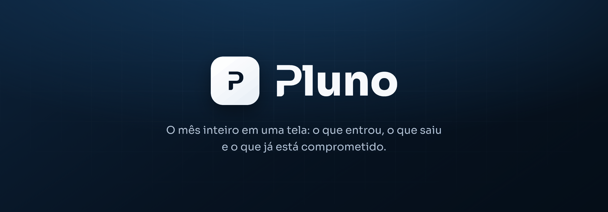
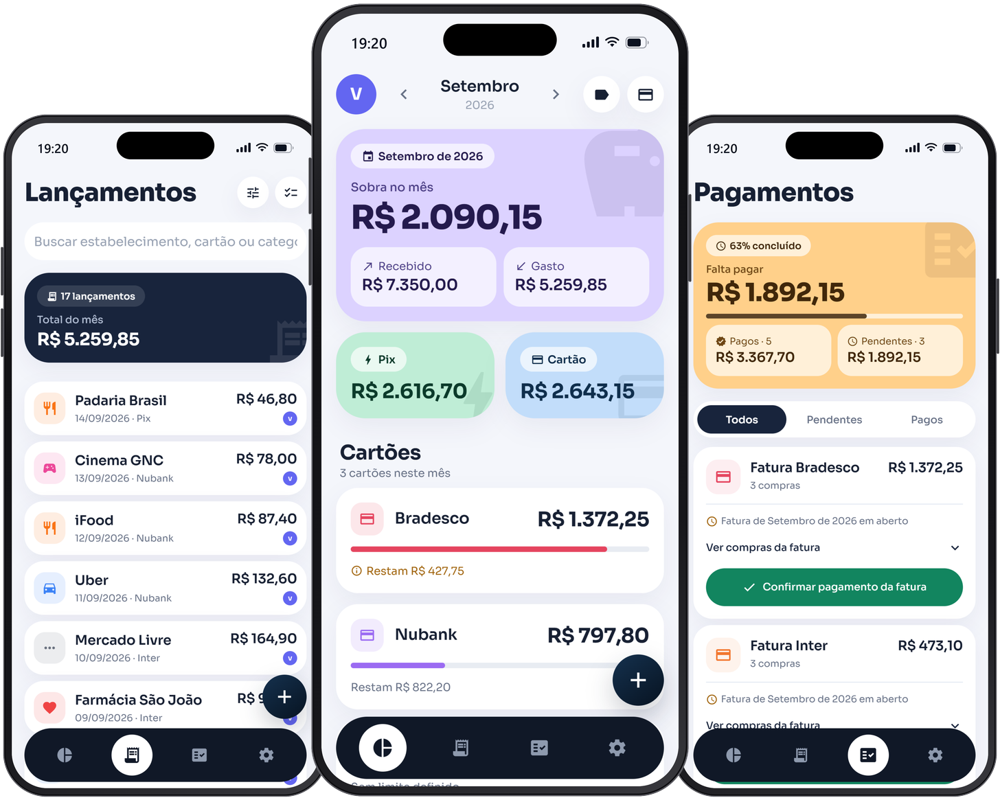

 
 

Sem cadastro: toque em <code>Continuar sem conta</code> e os dados ficam só no seu aparelho.

 
 

 

---

## Por que eu criei o Pluno

Eu queria ter um controle melhor das minhas finanças, então comecei usando uma planilha de Excel.

Durante um tempo funcionou, mas comecei a sentir falta de registrar mais detalhes das minhas compras. Queria saber qual cartão usei, a forma de pagamento, onde comprei, a data e outras informações que me ajudassem a entender melhor meus gastos.

Só que quanto mais informações eu colocava, mais chato ficava manter a planilha atualizada. E como eu faço praticamente tudo pelo celular, ter que abrir uma planilha e preencher várias células toda vez que fazia uma compra simplesmente não era prático.

Então comecei a testar alguns aplicativos de finanças. O problema é que nunca encontrava um que tivesse o equilíbrio que eu procurava. Alguns eram simples e rápidos, mas faltavam informações. Outros eram completos, mas registrar uma compra era complicado demais.

Foi por isso que decidi criar o Pluno.

A ideia era fazer algo que eu realmente usaria no dia a dia: abrir o app, registrar uma compra rapidamente, colocar os detalhes que importam e pronto.

Sem planilhas e sem transformar cada gasto em uma tarefa.

 

---

## O que ele faz

A ideia do Pluno é que você não precise ficar fazendo conta ou organizando tudo manualmente.

Você registra uma compra uma vez e o app cuida do resto. Se for parcelada, por exemplo, as parcelas já aparecem nos próximos meses automaticamente. Assim, você consegue saber não só quanto gastou agora, mas também quanto do seu dinheiro já está comprometido nos meses seguintes.

Na tela do mês, você consegue ver quanto recebeu, quanto gastou e quanto sobrou. Também dá para separar os gastos feitos por Pix dos gastos no cartão e acompanhar cada cartão individualmente.

As faturas também ficam organizadas dentro do app. Você consegue ver o que ainda vai vencer, o que já foi pago e quais compras fazem parte de cada fatura.

Além dos gastos, também dá para cadastrar seu salário e outras entradas de dinheiro, definir limites para cartões ou categorias e acompanhar quanto dos próximos seis meses já está comprometido.

Se você precisar separar suas finanças, pode criar espaços diferentes dentro da mesma conta e até compartilhar um deles com outra pessoa por e-mail.

E você não precisa criar uma conta para usar o Pluno. Dá para usar o app normalmente sem cadastro, mantendo as informações salvas apenas no seu próprio aparelho.

 

---

## Como acessar

Não precisa instalar nada para começar. Abra a [versão web](https://nubi-kohl.vercel.app), escolha **Continuar sem conta** e o app já funciona por inteiro — os dados ficam salvos só no seu navegador, e criar uma conta depois migra tudo para a nuvem.

O app também pode ser instalado direto do navegador (*Adicionar à tela de início* / *Instalar*) e passa a abrir sem a barra de endereço.

 

---

## Tecnologias

Uma única base de código no Android, no iOS e no navegador.

     

Expo Router · React 19 · Reanimated · Zustand · Row Level Security · PWA com service worker

 

---

Repositório de apresentação • Código-fonte proprietário

