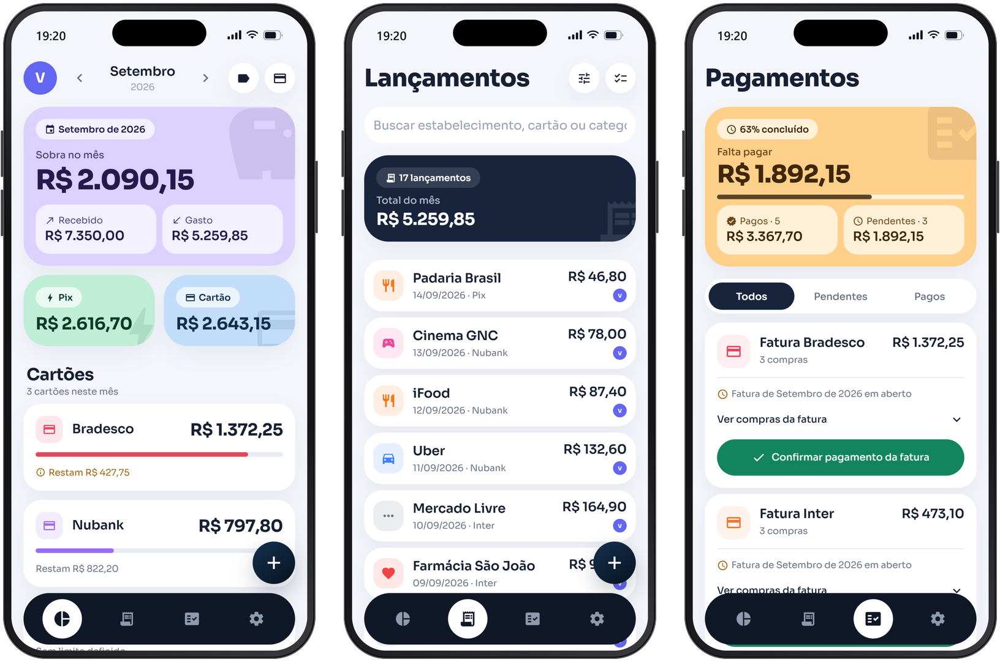
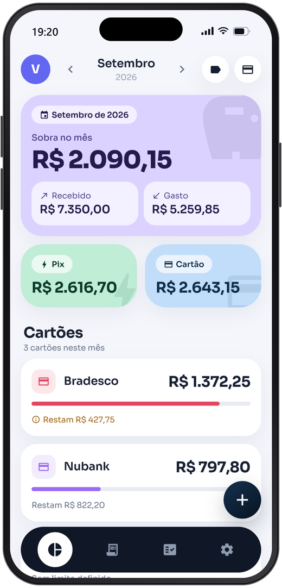
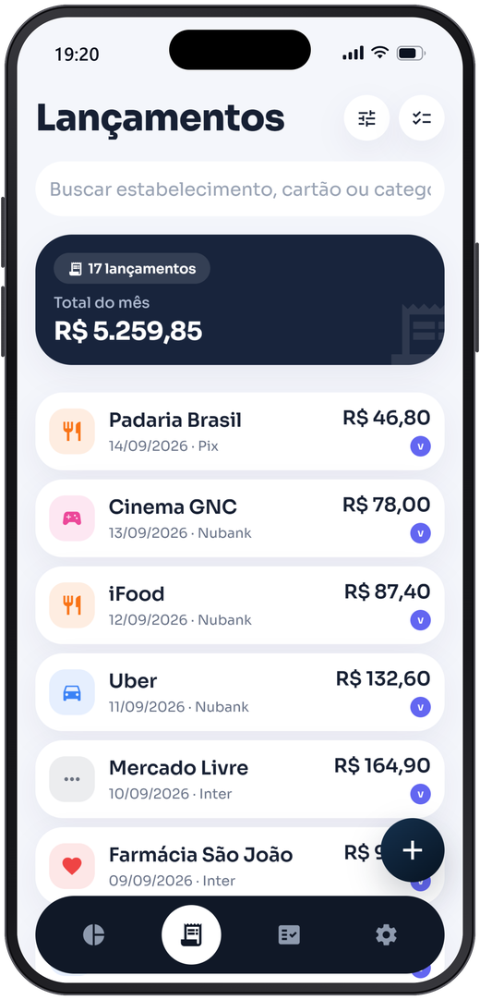
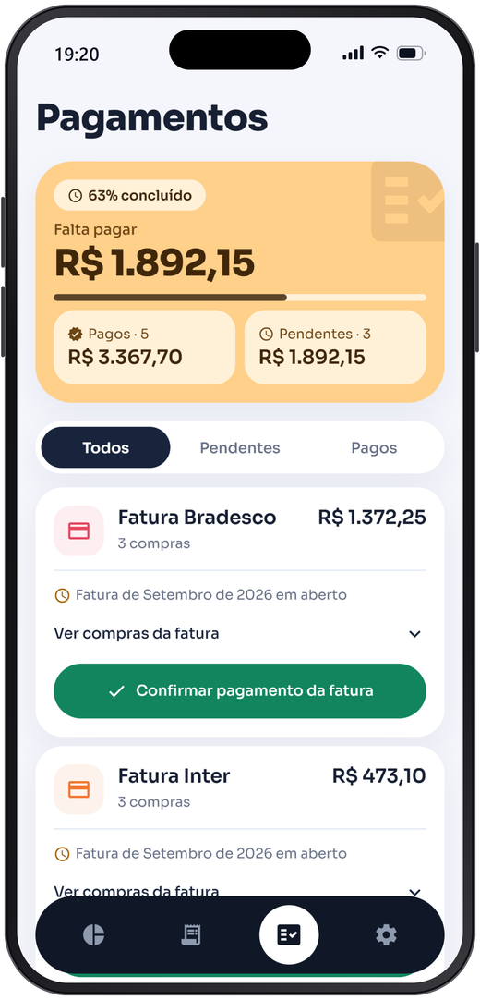

<div align="center">

  

  <h1>Pluno</h1>

  <h3>O mês inteiro em uma tela: o que entrou, o que saiu e o que já está comprometido.</h3>

  <p>
    Aplicativo de organização financeira pessoal.<br/>
    Renda, compras, cartões, faturas e limites em uma única visão mensal.
  </p>

  <br />

  <a href="https://nubi-kohl.vercel.app"></a>

  <sub>
    🔓 <strong>Sem cadastro:</strong>
    toque em <code>Continuar sem conta</code> e os dados ficam só no seu aparelho.
  </sub>

  <br />
  <br />

<a href="#-por-que-eu-criei-o-pluno">Por que criei</a> • <a href="#-visão-geral">Visão Geral</a> • <a href="#-recursos">Recursos</a> • <a href="#-telas">Telas</a> • <a href="#-acesso-à-demonstração">Demonstração</a> • <a href="#-tecnologias">Tecnologias</a>

</div>

<br />

---

## 💡 Por que eu criei o Pluno

Eu estava com dificuldade para organizar minhas finanças.

Comecei com uma **planilha de Excel**, e por bastante tempo ela deu conta. O problema apareceu quando quis anotar tudo o que realmente importava em cada compra: a forma de pagamento que usei, qual cartão passei, em qual estabelecimento comprei, em que dia foi. Cada lançamento virava uma pequena tarefa, e eu perdia um tempo enorme só preenchendo célula.

No celular ficava pior ainda. Mexer em planilha numa tela pequena é um exercício de paciência — e é justamente no celular que a gente está na hora em que a compra acontece.

Então fui **testar aplicativos**. Testei vários, e nenhum atendia tudo o que eu precisava: ou registrava rápido mas guardava pouca informação, ou guardava tudo mas exigia dez toques por compra.

No fim decidi criar o meu. O **Pluno** nasceu dessa necessidade simples: um app onde eu consigo colocar **todas as informações que quero, rápido e fácil**, e enxergar o mês inteiro organizado sem depender de planilha nenhuma.

<br />

---

## 📱 Visão Geral

O **Pluno** responde, sem planilha, a pergunta que aparece todo mês: **quanto ainda sobra?**

Cada compra é registrada uma vez — no Pix ou no cartão, fixa, variável ou parcelada — e o app cuida do resto: soma no mês certo, distribui as parcelas nos meses seguintes, agrupa as compras nas faturas e mostra o que já está comprometido antes mesmo do mês começar.

O objetivo é substituir os controles espalhados entre **planilhas, anotações e o extrato de cada banco** por uma visão mensal única, rápida de alimentar e honesta com o que ainda pode ser gasto.

<br />

<div align="center">
  
</div>

<br />

### Tudo começa em um lançamento.

```text
Renda do mês
   ↓
Lançamento (Pix ou cartão)
   ↓
Fixa · Variável · Parcelada
   ↓
Resumo do mês
   ↓
Faturas e pagamentos
   ↓
Projeção dos próximos meses
```

Toda compra conta **no mês em que foi feita**, e o cartão é só um rótulo — nome, cor e limite opcional. Uma compra parcelada em 3x gera automaticamente as cobranças dos três meses; uma despesa fixa acompanha o período de vigência sem precisar ser lançada de novo.

---

## 💜 Recursos

<table>
<tr>
<td width="50%" valign="top">

### 📊 Resumo do Mês

A visão geral da sua vida financeira no mês, atualizada a cada lançamento.

* Recebido, gasto e sobra do mês
* Divisão entre Pix e cartão
* Valores por cartão e por categoria
* Acompanhamento dos limites
* Projeção dos próximos seis meses
* Navegação livre entre os meses

</td>
<td width="50%" valign="top">

### 🧾 Lançamentos

Registre uma compra em segundos e encontre qualquer uma depois.

* Compras no Pix ou no cartão
* Fixas, variáveis ou parceladas
* Parcela em andamento (3/10)
* Busca por estabelecimento e cartão
* Filtros por tipo, cartão e categoria
* Seleção múltipla para editar e excluir

</td>
</tr>

<tr>
<td width="50%" valign="top">

### ✅ Pagamentos

Saiba exatamente o que vence no mês e o que já foi pago.

* Faturas e compras no Pix por mês
* Estados pendente e pago
* Progresso dos pagamentos
* Compras que compõem cada fatura
* Confirmação da fatura inteira
* Reabertura de uma marcação errada

</td>
<td width="50%" valign="top">

### 💰 Renda & Limites

Defina de onde vem o dinheiro e até onde ele pode ir.

* Salário recorrente com regra de data
* Entradas extras e período de vigência
* Limite mensal por cartão
* Limite mensal por categoria
* Aviso ao passar de 80%
* Tudo opcional, ativado quando quiser

</td>
</tr>

<tr>
<td width="50%" valign="top">

### 👥 Espaços Premium

Mais de um contexto financeiro na mesma conta, compartilhado com quem você quiser.

* Múltiplos espaços independentes
* Troca rápida do espaço ativo
* Convites por e-mail
* Dados compartilhados entre contas Pluno
* Cartões, categorias e limites por espaço

</td>
<td width="50%" valign="top">

### 🎨 Interface Adaptativa

A mesma experiência no celular, no navegador e no computador.

* Android, iOS e PWA instalável
* Tema automático, claro ou escuro
* Navegação por abas no celular
* Barra lateral e painéis no desktop
* Funciona offline na casca do PWA

</td>
</tr>

<tr>
<td width="50%" valign="top">

### 🔓 Modo Visitante

Dá para usar o app inteiro antes de decidir criar uma conta.

* Uso completo sem cadastro
* Dados guardados só no aparelho
* Nada é enviado para a nuvem
* Migração automática ao criar a conta
* Onboarding guiado na primeira abertura

</td>
<td width="50%" valign="top">

### 🔒 Privacidade & Segurança

Os dados são seus, e a conta vale por pessoa.

* Isolamento por espaço no banco
* Sessão guardada no Keychain/Keystore
* Uma sessão ativa por tipo de aparelho
* Reautenticação para trocar senha ou e-mail
* Exclusão definitiva da conta pelo app

</td>
</tr>
</table>

---

## 🖼 Telas

<table>
<tr>
<td width="33%" align="center" valign="top">
  
  <br />
  <strong>Resumo</strong>
  <br />
  <sub>Sobra do mês, Pix, cartões e limites.</sub>
</td>
<td width="33%" align="center" valign="top">
  
  <br />
  <strong>Lançamentos</strong>
  <br />
  <sub>Todas as compras do mês, com busca e filtros.</sub>
</td>
<td width="33%" align="center" valign="top">
  
  <br />
  <strong>Pagamentos</strong>
  <br />
  <sub>Faturas e Pix a pagar, pendentes e pagos.</sub>
</td>
</tr>
</table>

---

## ⚡ Acesso à Demonstração

Quer conhecer o Pluno na prática? Não precisa de cadastro nem de credenciais de teste.

Abra a versão web, escolha **Continuar sem conta** e explore o app inteiro com os dados salvos apenas no seu navegador.

<br />

|     | Plataforma          | Acesso                                                         |
| :-: | :------------------ | :------------------------------------------------------------- |
|  🌐 | **App Web (PWA)**   | [Acessar nubi-kohl.vercel.app ↗](https://nubi-kohl.vercel.app) |

### Como entrar

| Modo                  | O que acontece                                                                   |
| :-------------------- | :------------------------------------------------------------------------------- |
| `Continuar sem conta` | Uso completo, com os dados guardados somente no aparelho.                          |
| `Criar conta`         | Sincronização pelo Supabase — os dados do modo visitante sobem para a conta.       |

> [!TIP]
> No celular ou no computador, o app pode ser instalado direto do navegador (*Adicionar à tela de início* / *Instalar*) e passa a abrir como um aplicativo, sem a barra de endereço.

> [!NOTE]
> O modo visitante guarda tudo no armazenamento local. Limpar os dados do navegador apaga os lançamentos criados na demonstração.

> [!WARNING]
> Ambiente de demonstração. Utilize apenas valores fictícios durante os testes.

---

## 🛠 Tecnologias

O Pluno roda a partir de uma única base de código no Android, no iOS e no navegador.

<div align="center">


</div>

<div align="center">
  <sub>
    Expo Router · React 19 · Reanimated · Zustand · Row Level Security · PWA com service worker
  </sub>
</div>

---

<div align="center">

  

  <br />
  <br />

<strong>Pluno</strong>

  <br />

<sub>Organização financeira pessoal.</sub>

  <br />
  <br />

  <sub>
    Repositório demonstrativo • Código-fonte proprietário
  </sub>

</div>
